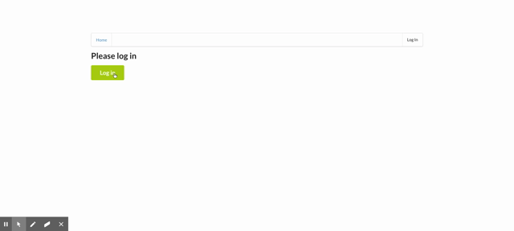

# cloud-developer
content for Udacity's cloud developer nanodegree

# Table of Contents:
1. [General info](#general-info)
2. [Technologies](#technologies)
3. [Course Materials](#course-materials)

## General info
This repository contains materials from Udacity Cloud Developer Nanodegree

## Technologies
* AWS SDK
* CI/CD, Docker, Travis, Kubernetes
* Elastic Beanstalk
* AWS RDBMS, Lambda, API Gateway, Cloudwatch, X-Ray, S3
* Serverless Framework
* AWS IAM Policies and Permission

## Course Materials

**Course 2: Full Stack Apps on AWS**
1. Monolith vs Microservice App
2. Data Storage in Cloud Intro: S3
3. Deploy Server to Cloud: Elastic Beanstalk, RDS Database
4. Auth with bcrypt and JWT

**Course 3: Refactor Monolith to Microservices App on AWS**
1. Microservices Intro
2. Docker for Container
3. Continuous Integration with Travis Build
4. Continuous Deployment with Kubernetes Orchestration
5. Best Practice: Nginx, Scaling and Self-Healing

**Course 4: Serverless**
1. Serverless 
2. REST API in Serverless
3. Serverless Framework
4. Event Processing
5. Authentication with Auth0, OAuth
6. Best Practices - Express with AWS Lambda

**Exercise Demo:**

**Course 4 Demo:** 

